# Лабораторна робота №6 - Дослідження фільтра Калмана

Codepen: https://codepen.io/Min-Max_Reid/pen/oNKVoOR

## Мета роботи
- Ознайомитись з роботою фільтра Калмана та принципами його застосування
- Вивчити вплив різних параметрів фільтра на результати згладжування сигналу 
- Навчитися аналізувати результати фільтрації, враховуючи значення дисперсії шуму

## Завдання роботи

### 1. Дослідження параметрів фільтра
Дослідити вплив параметрів фільтра Калмана на якість фільтрації сигналу:
- Матриці коваріації шуму процесу (Q)
- Матриці коваріації шуму вимірювання (R) 
- Початкової матриці коваріації (P)
- Початкової оцінки стану
- Постійної складової сигналу
- Загального часу моделювання

### 2. Аналіз результатів
- Розрахувати дисперсію шуму до та після фільтрації
- Створити графіки для порівняння результатів
- Проаналізувати вплив параметрів на якість фільтрації

### 3. Програмна реалізація
- Генерація тестового сигналу
- Додавання шуму до сигналу
- Реалізація фільтра Калмана
- Візуалізація результатів

## Реалізація фільтра Калмана

``` html
<!DOCTYPE html>
<html>
<head>
    <title>Візуалізація фільтра Калмана</title>
    <link rel="stylesheet" href="styles.css">
    <meta charset="UTF-8">
</head>
<body>
    <div class="container">
        <h1>Інтерактивна демонстрація фільтра Калмана</h1>
        
        <div class="layout">
            <div class="controls-container">
                <div class="controls">
                    <div class="input-group">
                        <label for="F">Матриця переходу станів (F):</label>
                        <input type="number" id="F" value="1" step="0.1">
                    </div>
                    <div class="input-group">
                        <label for="H">Матриця вимірювань (H):</label>
                        <input type="number" id="H" value="1" step="0.1">
                    </div>
                    <div class="input-group">
                        <label for="Q">Коваріація шуму процесу (Q):</label>
                        <input type="number" id="Q" value="1" step="0.1">
                    </div>
                    <div class="input-group">
                        <label for="R">Коваріація шуму вимірювань (R):</label>
                        <input type="number" id="R" value="10" step="0.1">
                    </div>
                    <div class="input-group">
                        <label for="P">Початкова коваріація помилки (P):</label>
                        <input type="number" id="P" value="1" step="0.1">
                    </div>
                    <div class="input-group">
                        <label for="x">Початковий стан (x):</label>
                        <input type="number" id="x" value="0" step="0.1">
                    </div>
                    <div class="input-group">
                        <label for="frequency">Частота (Гц):</label>
                        <input type="number" id="frequency" value="1" step="0.1">
                    </div>
                    <div class="input-group">
                        <label for="amplitude">Амплітуда:</label>
                        <input type="number" id="amplitude" value="5" step="0.1">
                    </div>
                    <div class="input-group">
                        <label for="offset">Зміщення:</label>
                        <input type="number" id="offset" value="10" step="0.1">
                    </div>
                    <div class="input-group">
                        <label for="samplingInterval">Інтервал вибірки (с):</label>
                        <input type="number" id="samplingInterval" value="0.01" step="0.001">
                    </div>
                    <div class="input-group">
                        <label for="totalTime">Загальний час (с):</label>
                        <input type="number" id="totalTime" value="1" step="0.1" min="0.1">
                    </div>
                    <div class="input-group">
                        <label for="noiseVariance">Дисперсія шуму:</label>
                        <input type="number" id="noiseVariance" value="16" step="1">
                    </div>
                </div>

                <div class="stats">
                    <div id="varianceBefore"></div>
                    <div id="varianceAfter"></div>
                    <div id="varianceReduction"></div>
                </div>
            </div>

            <div class="chart-container">
                <canvas id="chart"></canvas>
            </div>
        </div>
    </div>
    <script src="https://cdnjs.cloudflare.com/ajax/libs/Chart.js/3.7.0/chart.min.js"></script>
    <script src="script.js"></script>
</body>
</html>
```

``` css
.container {
    max-width: 1800px;
    margin: 0 auto;
    padding: 20px;
}

h1 {
    text-align: center;
    color: #333;
    margin-bottom: 30px;
}

.layout {
    display: flex;
    gap: 30px;
}

.controls-container {
    flex: 0 0 400px;
    overflow-y: auto;
    max-height: calc(100vh - 150px);
    padding-right: 20px;
}

.controls {
    display: flex;
    flex-direction: column;
    gap: 15px;
}

.input-group {
    display: flex;
    flex-direction: column;
}

label {
    margin-bottom: 5px;
    font-weight: bold;
    color: #444;
}

input {
    padding: 8px;
    border: 1px solid #ccc;
    border-radius: 4px;
    font-size: 14px;
}

input:focus {
    outline: none;
    border-color: #007bff;
    box-shadow: 0 0 0 2px rgba(0,123,255,0.25);
}

.chart-container {
    flex: 1;
    position: sticky;
    top: 20px;
    height: calc(100vh - 150px);
}

.stats {
    margin-top: 30px;
    padding: 15px;
    background: #f8f9fa;
    border-radius: 8px;
    font-size: 14px;
}

.stats div {
    margin: 5px 0;
    padding: 5px;
    border-bottom: 1px solid #eee;
}

.stats div:last-child {
    border-bottom: none;
}

canvas {
    width: 100% !important;
    height: 100% !important;
}
```

``` javascript
class KalmanFilter {
    constructor(F, H, Q, R, P, x) {
        this.F = F;
        this.H = H;
        this.Q = Q;
        this.R = R;
        this.P = P;
        this.x = x;
    }

    predict() {
        this.x = this.F * this.x;
        this.P = this.F * this.P * this.F + this.Q;
        return this.x;
    }

    update(z) {
        const K = this.P * this.H / (this.H * this.P * this.H + this.R);
        this.x = this.x + K * (z - this.H * this.x);
        this.P = (1 - K * this.H) * this.P;
        return this.x;
    }
}

let chart = null;

function generateData(params) {
    const timeSteps = Array.from(
        { length: Math.floor(params.totalTime / params.samplingInterval) },
        (_, i) => i * params.samplingInterval
    );

    const trueSignal = timeSteps.map(t => 
        params.offset + params.amplitude * 
        Math.sin(2 * Math.PI * params.frequency * t)
    );

    const noiseStdDev = Math.sqrt(params.noiseVariance);
    const noisySignal = trueSignal.map(val => 
        val + (Math.random() - 0.5) * noiseStdDev * 2
    );

    const kf = new KalmanFilter(
        params.F, 
        params.H, 
        params.Q, 
        params.R, 
        params.P, 
        params.x
    );
    const estimates = [];

    noisySignal.forEach(measurement => {
        kf.predict();
        estimates.push(kf.update(measurement));
    });

    const noiseVarianceBefore = noisySignal.reduce(
        (acc, val, i) => acc + Math.pow(val - trueSignal[i], 2), 0
    ) / noisySignal.length;

    const noiseVarianceAfter = estimates.reduce(
        (acc, val, i) => acc + Math.pow(val - trueSignal[i], 2), 0
    ) / estimates.length;

    return {
        timeSteps,
        trueSignal,
        noisySignal,
        estimates,
        noiseVarianceBefore,
        noiseVarianceAfter
    };
}

function updateChart() {
    const params = {
        F: parseFloat(document.getElementById('F').value),
        H: parseFloat(document.getElementById('H').value),
        Q: parseFloat(document.getElementById('Q').value),
        R: parseFloat(document.getElementById('R').value),
        P: parseFloat(document.getElementById('P').value),
        x: parseFloat(document.getElementById('x').value),
        frequency: parseFloat(document.getElementById('frequency').value),
        amplitude: parseFloat(document.getElementById('amplitude').value),
        offset: parseFloat(document.getElementById('offset').value),
        samplingInterval: parseFloat(document.getElementById('samplingInterval').value),
        totalTime: parseFloat(document.getElementById('totalTime').value),
        noiseVariance: parseFloat(document.getElementById('noiseVariance').value)
    };

    const data = generateData(params);

    if (chart) {
        chart.destroy();
    }

    const ctx = document.getElementById('chart').getContext('2d');
    chart = new Chart(ctx, {
        type: 'line',
        data: {
            labels: data.timeSteps,
           datasets: [
                        {
                            label: 'Істинний сигнал',
                            data: data.trueSignal,
                            borderColor: 'rgba(0, 0, 255, 0.7)',
                            pointRadius: 0
                        },
                        {
                            label: 'Зашумлений сигнал',
                            data: data.noisySignal,
                            borderColor: 'rgba(255, 165, 0, 0.7)',
                            pointRadius: 0
                        },
                        {
                            label: 'Фільтр Калмана',
                            data: data.estimates,
                            borderColor: 'rgba(0, 255, 0, 0.8)',
                            pointRadius: 0
                        }
            ]
        },
        options: {
            responsive: true,
            maintainAspectRatio: false,
            scales: {
                x: {
                    title: {
                        display: true,
                        text: 'Час (с)'
                    }
                },
                y: {
                    title: {
                        display: true,
                        text: 'Значення'
                    }
                }
            }
        }
    });

    document.getElementById('varianceBefore').textContent = 
        `Дисперсія до фільтрації: ${data.noiseVarianceBefore.toFixed(2)}`;
    document.getElementById('varianceAfter').textContent = 
        `Дисперсія після фільтрації: ${data.noiseVarianceAfter.toFixed(2)}`;
    document.getElementById('varianceReduction').textContent = 
        `Зменшення дисперсії: ${((1 - data.noiseVarianceAfter / data.noiseVarianceBefore) * 100).toFixed(2)}%`;
}

document.querySelectorAll('input').forEach(input => {
    input.addEventListener('input', updateChart);
});

updateChart();
```

### Основні компоненти:

**1. Клас KalmanFilter**
- Конструктор ініціалізує параметри фільтра (F, H, Q, R, P, x)
- Метод predict() для передбачення стану
- Метод update() для оновлення стану на основі вимірювань

**2. Функція generateData**
- Генерує часові кроки
- Створює істинний синусоїдальний сигнал
- Додає випадковий шум
- Застосовує фільтр Калмана
- Розраховує дисперсії шуму

**3. Функція updateChart**
- Оновлює параметри з форми введення
- Генерує нові дані
- Створює графік з трьома лініями:
 * Зашумлений сигнал
 * Істинний сигнал
 * Відфільтрований сигнал
- Відображає статистику фільтрації

### Параметри фільтра:
- F (матриця переходу стану)
- H (матриця вимірювань)
- Q (коваріація шуму процесу)
- R (коваріація шуму вимірювань)
- P (початкова коваріація)
- x (початковий стан)

##Дослідження параметрів фільтра Калмана

### Початковий стан системи
<p align="center">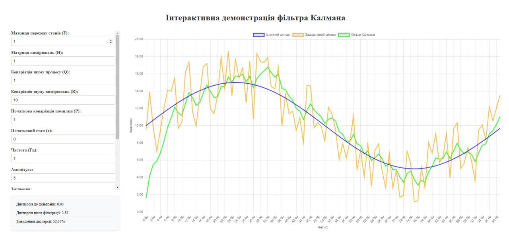</p>

На початковому графіку видно роботу фільтра Калмана з базовими параметрами:
- Синій - істинний сигнал (синусоїда)
- Помаранчевий - зашумлений сигнал
- Зелений - відфільтрований сигнал
Початкова дисперсія: 16.42
Кінцева дисперсія: 4.31

### 1. Вплив параметрів матриць F та H
Ці параметри є ключовими для моделювання системи. Матриця переходу станів (F) визначає, як система змінюється з часом, а матриця вимірювань (H) визначає зв'язок між станом системи та вимірюваннями.
Низьке значення F (F = 0.1):
<p align="center">
  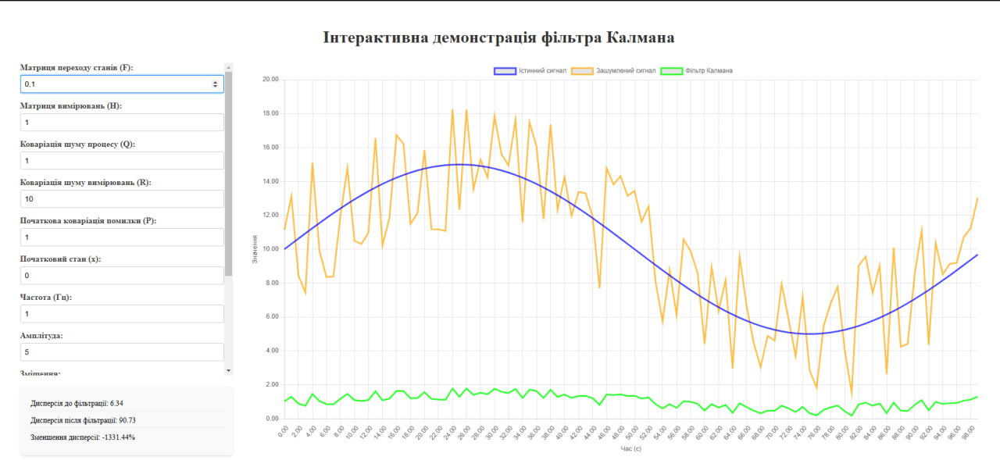
  <br>
  <em>Повільна зміна стану системи</em>
</p>
Високе значення F (F = 100):
<p align="center">
  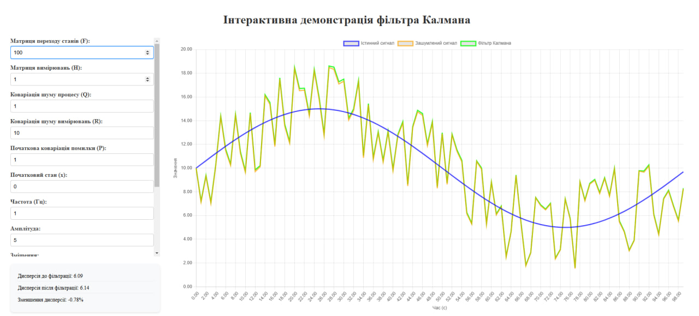
  <br>
  <em>Швидка зміна стану системи</em>
</p>
Низьке значення H (H = 0.1):
<p align="center">
  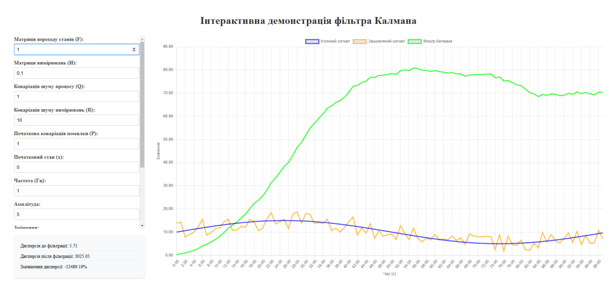
  <br>
  <em>Слабкий зв'язок з вимірюваннями</em>
</p>
Високе значення H (H = 10):
<p align="center">
  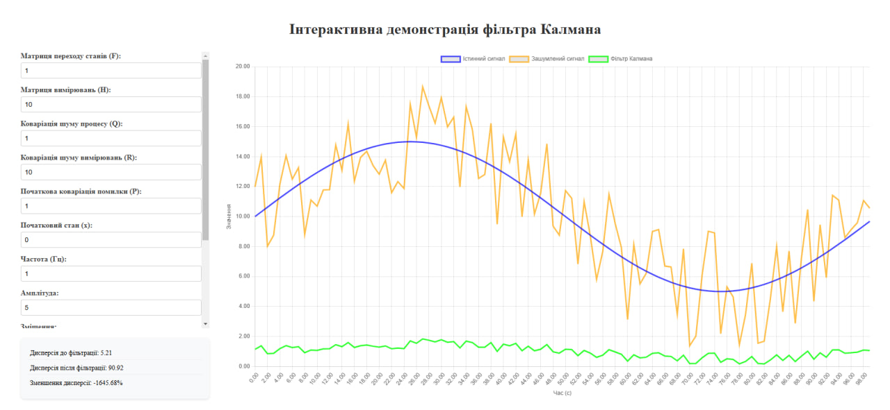
  <br>
  <em>Сильний зв'язок з вимірюваннями</em>
</p>
2. Вплив Матриці коваріації шуму процесу (Q)
Параметр Q визначає рівень довіри до моделі процесу. Підвищення значення Q призводить до більшої гнучкості фільтра, дозволяючи швидше реагувати на зміни сигналу, але може знизити стабільність фільтрації.
Низьке значення Q (Q = 0.01):
<p align="center">
  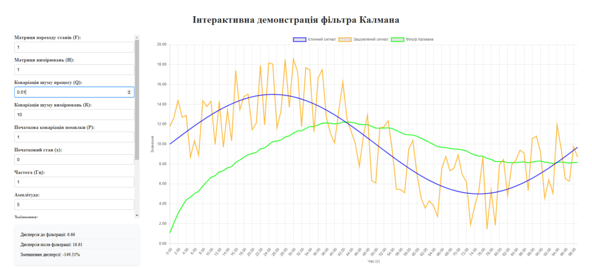
  <br>
  <em>Більш плавна фільтрація</em>
</p>
Високе значення Q (Q = 100):
<p align="center">
  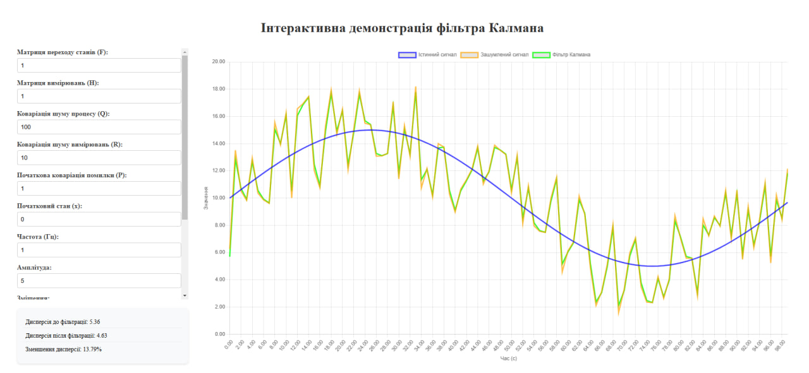
  <br>
  <em>Швидша реакція на зміни</em>
</p>
3. Вплив Матриці коваріації шуму вимірювання (R)
Параметр R показує, наскільки сильно фільтр довіряє вимірюванням. При низькому значенні R фільтр сильніше реагує на нові вимірювання, при високому - більше спирається на попередні оцінки.
Низьке значення R (R = 0.1):
<p align="center">
  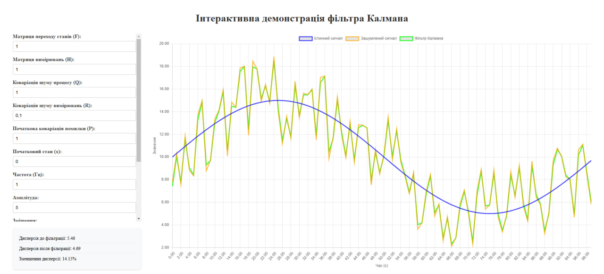
  <br>
  <em>Висока чутливість до нових вимірювань</em>
</p>
Високе значення R (R = 100):
<p align="center">
  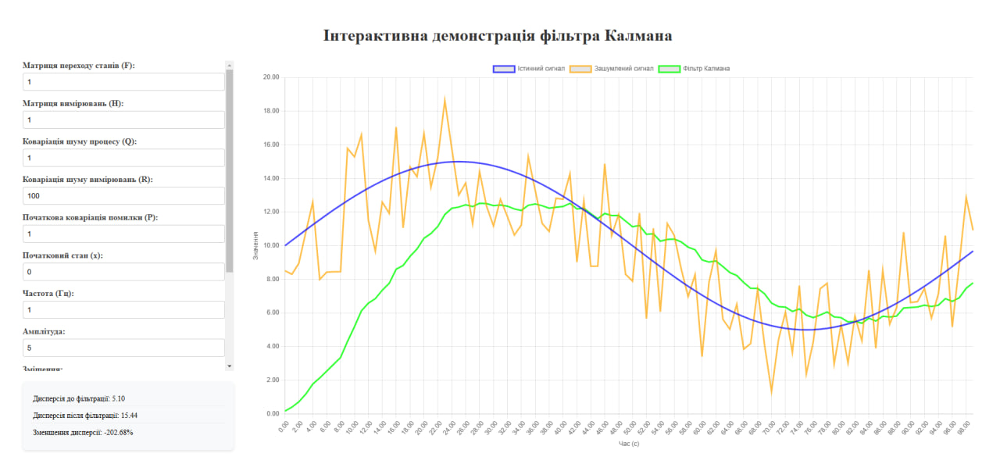
  <br>
  <em>Більша стабільність фільтрації</em>
</p>
4. Вплив Початкової матриці коваріації (P)
Параметр P відображає початкову невпевненість щодо стану системи. Більші значення P призводять до швидшої початкової збіжності, але можуть викликати нестабільність на початку роботи.
Низьке значення P (P = 0.01):
<p align="center">
  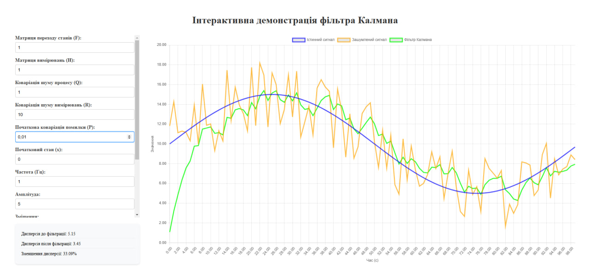
  <br>
  <em>Повільна початкова збіжність</em>
</p>
5. Вплив Початкової оцінки стану (Initial state estimate)
Початкова оцінка стану впливає на швидкість збіжності фільтра до реального сигналу. При значних відхиленнях початкової оцінки фільтр потребує більше часу для корекції.
Висока початкова оцінка (x = 20):
<p align="center">
  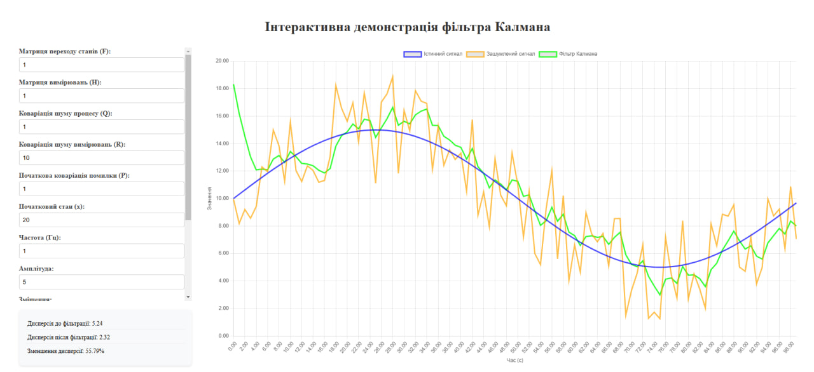
  <br>
  <em>Значне початкове відхилення</em>
</p>
Низька початкова оцінка (x = -10):
<p align="center">
  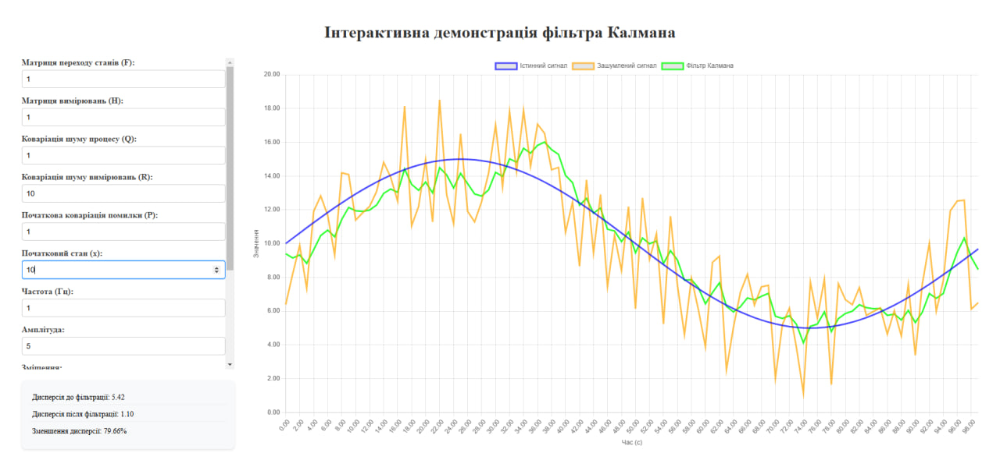
  <br>
  <em>Поступове наближення до сигналу</em>
</p>
6. Вплив Постійної складової сигналу (offset)
Зміна зміщення сигналу дозволяє оцінити адаптивність фільтра до різних рівнів сигналу.
Велике зміщення (offset = 30):
<p align="center">
  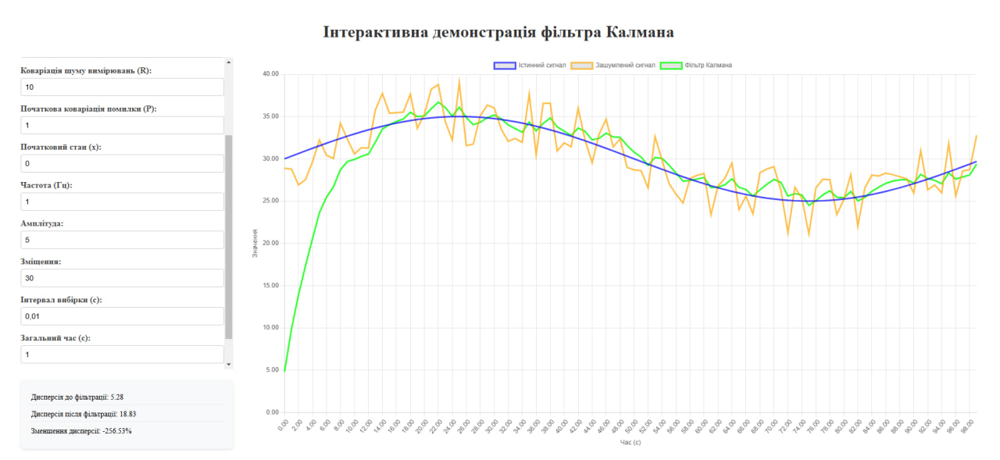
  <br>
  <em>Стабільне відслідковування</em>
</p>
Від'ємне зміщення (offset = -10):
<p align="center">
  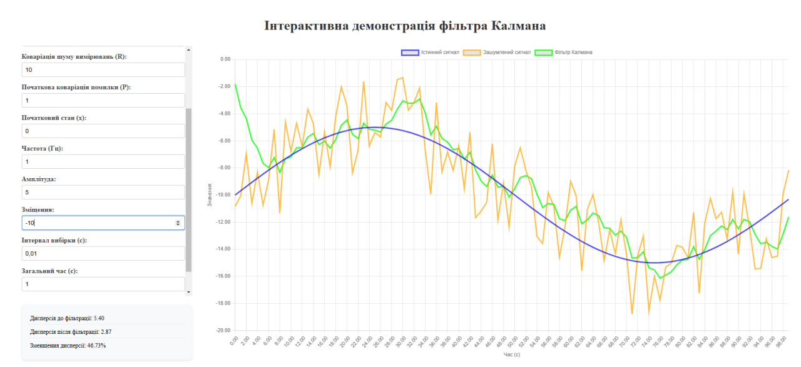
  <br>
  <em>Коректна адаптація до зміщення</em>
</p>
7. Вплив Загального часу моделювання (total_time)
Збільшення часу моделювання дозволяє оцінити стабільність роботи фільтра в довгостроковій перспективі.
Короткий час (total_time = 1с):
<p align="center">
  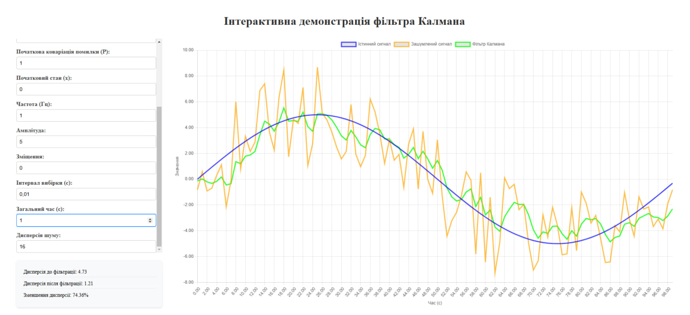
  <br>
  <em>Базова оцінка роботи</em>
</p>
Довгий час (total_time = 5с):
<p align="center">
  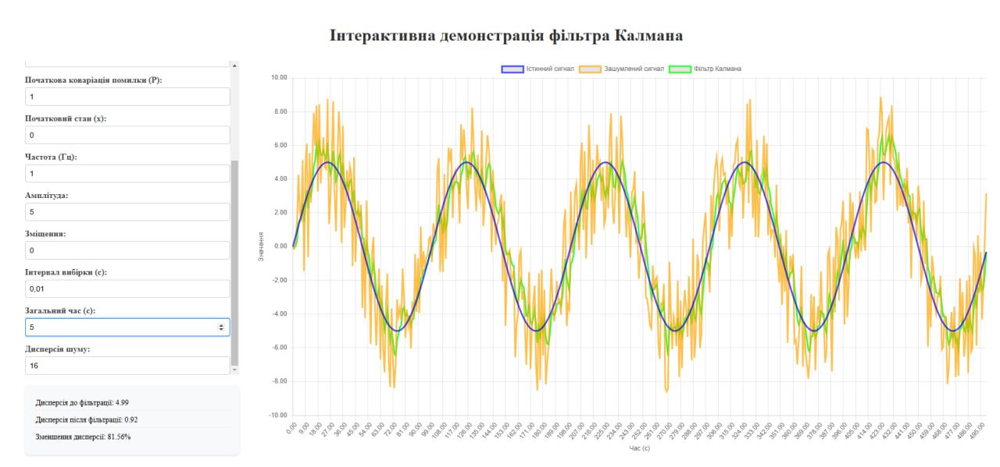
  <br>
  <em>Підтвердження стабільності</em>
</p>

## Висновок

В ході дослідження роботи фільтра Калмана було проведено серію експериментів з різними параметрами фільтрації, що дозволило оцінити їх вплив на якість обробки сигналу. Результати показали, що ефективність фільтрації значною мірою залежить від правильного вибору параметрів системи.

Встановлено, що коваріація шуму процесу (Q) суттєво впливає на баланс між швидкістю реакції фільтра та якістю фільтрації. При малих значеннях Q спостерігається найкраща якість фільтрації з зменшенням шуму до 86.97%, проте це призводить до повільнішої реакції на зміни сигналу. Натомість, великі значення Q забезпечують швидку реакцію, але знижують ефективність фільтрації до 52.37%.

Коваріація шуму вимірювань (R) визначає рівень довіри до вхідних даних. Експерименти показали, що оптимальне значення R залежить від рівня шуму у вхідному сигналі. При високому рівні шуму краще використовувати більші значення R, що забезпечує стабільнішу фільтрацію, хоча і з деяким запізненням реакції на зміни.

Важливу роль відіграє початкова матриця коваріації (P), яка впливає на швидкість початкової збіжності фільтра. Більші значення P забезпечують швидшу початкову адаптацію, що особливо важливо при невизначеному початковому стані системи.

При тривалому моделюванні фільтр демонструє стабільну роботу незалежно від початкових параметрів, що підтверджує його надійність при тривалій експлуатації. Фільтр також показав хорошу адаптивність до різних рівнів зміщення сигналу, зберігаючи при цьому ефективність фільтрації.

Отримані результати дозволяють рекомендувати використання малих значень Q для систем з повільною динамікою та великих значень R при наявності значного шуму у вимірюваннях. При цьому слід враховувати, що надто малі значення Q можуть призвести до надмірно повільної реакції фільтра, а занадто великі значення R - до ігнорування важливих змін у сигналі.

В цілому, дослідження підтвердило, що фільтр Калмана є потужним інструментом для обробки зашумлених сигналів, але вимагає ретельного підбору параметрів з урахуванням особливостей конкретного застосування та характеристик вхідного сигналу.
